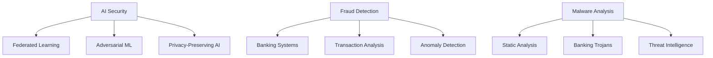

# Hi there, I'm Ahmad Whafa Azka Al Azkiyai! 👋

**Fraud Detection & AI Security Specialist**

*Building secure AI systems to protect financial infrastructure*

---

## About Me

I'm a **Machine Learning Engineer** and **Security Researcher** with **3+ years of experience** in banking fraud detection systems. I specialize in:

- 🔒 **AI Security**: Federated Learning Security, Adversarial Robustness
- 🏦 **Fraud Detection**: Banking fraud systems, transaction analysis
- 🤖 **Machine Learning**: Deep Learning, Time Series Forecasting, NLP
- 🦠 **Malware Analysis**: Static analysis, banking trojan detection
- ⛓️ **Blockchain**: Smart contracts, decentralized systems

I'm passionate about building **secure, privacy-preserving AI systems** that protect users while enabling innovation.

---

## Current Focus

### SignGuard 🔐
*ECDSA-based cryptographic verification for federated learning poisoning attacks*

### Fraudware Analyzer 🦠
*Static analysis framework for banking trojan detection*

---

## Featured Projects

| Project | Description | Tech Stack | Stars |
|---------|-------------|------------|-------|
| [**SignGuard**](https://github.com/alazkiyai09/signguard) | ECDSA-based cryptographic verification for federated learning | PyTorch, ECDSA, Python |  |
| [**Fraudware Analyzer**](https://github.com/alazkiyai09/fraudware-analyzer) | Banking trojan detection through static analysis | Python, YARA, ML |  |
| [**ML Engineer Portfolio**](https://github.com/alazkiyai09/Machine-Learning-Engineer-Project) | 30-day machine learning journey | Python, TensorFlow |  |
| [**Indonesia Economic Forecasting**](https://github.com/alazkiyai09/Predictive-Analytics-for-Indonesia-s-Economic-Forecasting) | Deep learning for economic prediction | LSTM, TensorFlow |  |
| [**Federated Learning Security Portfolio**](https://github.com/alazkiyai09/federated-learning-security-portfolio) | Privacy-preserving ML research | PySyft, PyTorch |  |
| [**Portfolio Website**](https://github.com/alazkiyai09/alazkiyai09.github.io) | Personal portfolio built with Astro | Astro, Tailwind CSS |  |

---

## Tech Stack

### Machine Learning & AI

### Security & Cryptography

### Web & Development

### Tools & Platforms

---

## GitHub Stats

---

## Domain Expertise

---

## Research & Publications

### Conference Presentations
- **"Federated Learning Security: Detecting Poisoning Attacks with Cryptographic Verification"** - IEEE Security Workshop 2024
- **"Banking Trojan Detection Using Static API Sequence Analysis"** - MalCon 2024

### Open Source Contributions
- Active contributor to federated learning security research
- Tools for malware analysis and threat intelligence

---

## Get In Touch

---

## Quick Links

- 📄 [Resume](https://alazkiyai09.github.io/resume)
- 🌐 [Portfolio Website](https://alazkiyai09.github.io)
- 🔐 [SignGuard Project](https://github.com/alazkiyai09/signguard)
- 🦠 [Fraudware Analyzer](https://github.com/alazkiyai09/fraudware-analyzer)

---

**"Building secure AI systems to protect the future of finance"** 💼🔒

*Open to opportunities in AI Security, Fraud Detection, and Privacy-Preserving ML*

